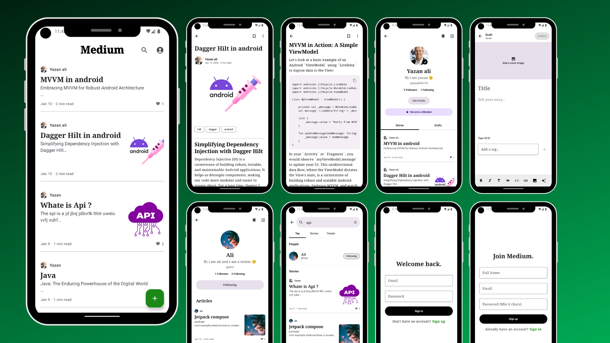
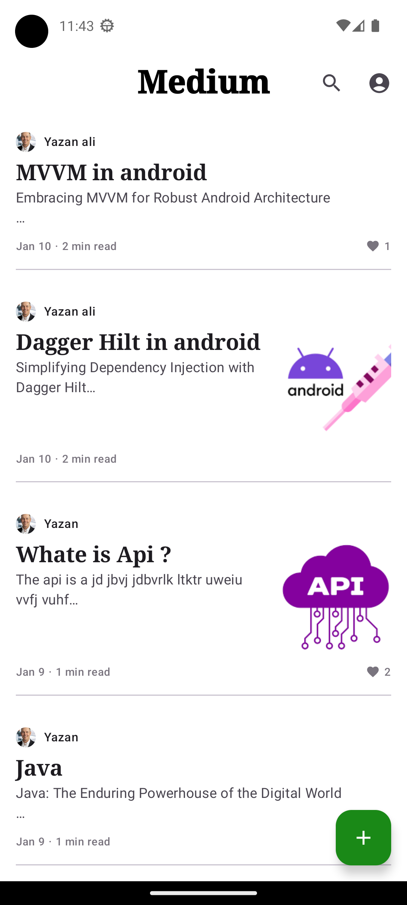
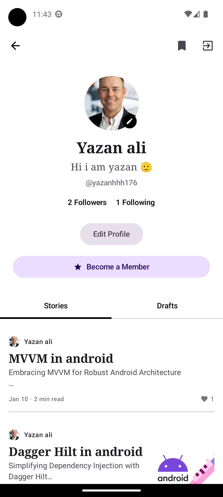
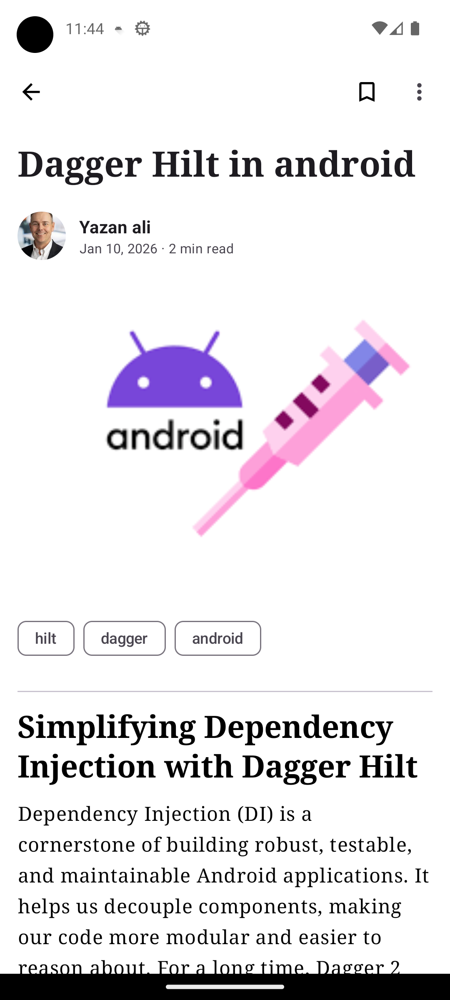
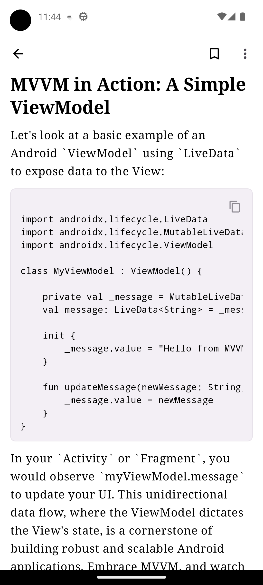
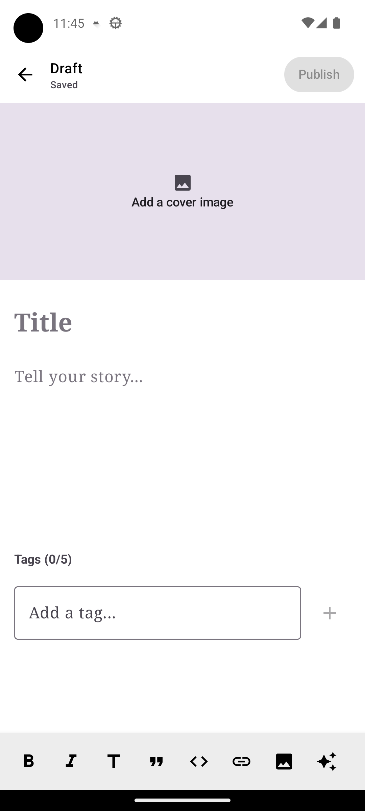
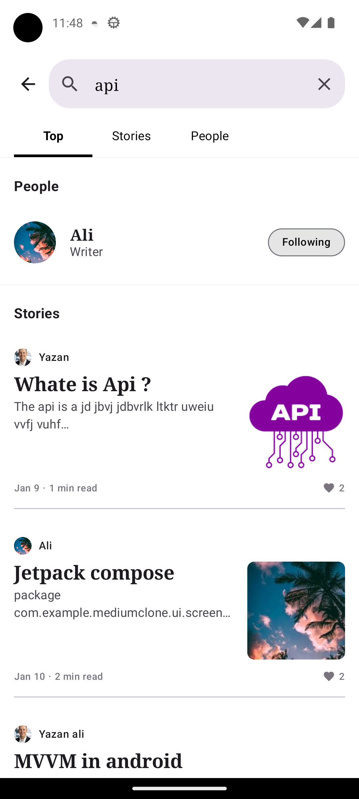
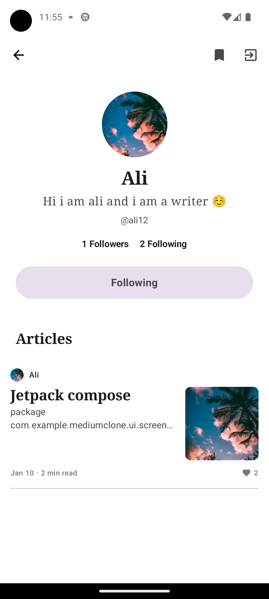
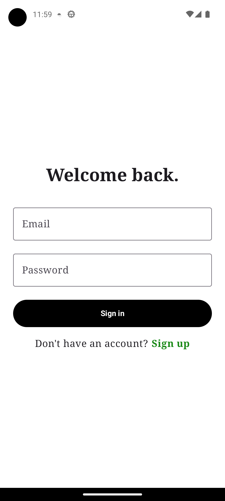
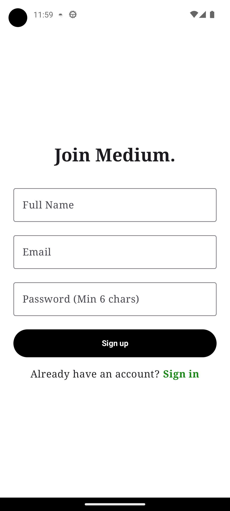

# 💎 Medium Clone - Ultra Premium Edition

[](https://kotlinlang.org)
[](https://developer.android.com/jetpack/compose)
[](https://firebase.google.com)
[](https://dagger.dev/hilt/)
[](https://deepmind.google/technologies/gemini/)

> **A high-fidelity, luxury blogging platform built with modern Android engineering standards.**
> Experience writing and reading like never before with AI-powered tools, real-time sync, and a premium monetization ecosystem.

---

## 📱 Project Overview

This project is a sophisticated **Native Android Application** that reimagines the blogging experience. It goes beyond a simple clone by integrating **Generative AI**, **Secure Payment Simulations**, and **Offline-First Architecture**. 

Every interaction is polished, from the "Shimmering" Gold Pro badges to the haptic feedback on the "Clap" button.

---



---

### ✨ Key Features

-   **🤖 AI-Powered Writing Assistant**: Integrated **Google Gemini SDK** to help authors generate ideas, refine drafts, and fix grammar instantly.
-   **💎 Premium Ecosystem**:
    -   **Native Secure Checkout**: A custom-built, banking-grade payment UI with card flip animations and OTP verification (Simulated).
    -   **Gold Pro Status**: Real-time cross-device sync of Premium status via Firestore.
    -   **Exclusive Content**: Smart Paywall blocking premium articles for free users.
-   **📝 Smart Editor**:
    -   **Autosave**: Never lose a word. Drafts save locally every 2 seconds (Room Database).
    -   **Rich Media**: Support for text, links, and formatting.
-   **🎨 Luxurious UI/UX**:
    -   **Dark Mode Optimized**: Deep contrasts and elegant typography.
    -   **Fluid Animations**: Smooth transitions using Compose Animation APIs.
    -   **Zero Jiggle**: Perfectly stabilized layouts.

---

## 🛠 Tech Stack

| Category | Technologies |
| :--- | :--- |
| **UI** | [Jetpack Compose](https://developer.android.com/jetpack/compose), Material3 |
| **Architecture** | MVVM, Clean Architecture, Repository Pattern |
| **Dependency Injection** | [Hilt](https://dagger.dev/hilt/) |
| **Network & Backend** | [Firebase Firestore](https://firebase.google.com/docs/firestore), [Firebase Auth](https://firebase.google.com/docs/auth) |
| **Local Data** | [Room](https://developer.android.com/training/data-storage/room), DataStore |
| **AI** | [Google Generative AI SDK](https://ai.google.dev/) |
| **Concurrency** | Kotlin Coroutines, Flow |

---

## 🏗 Architecture

The app follows the recommended **Guide to App Architecture**:

```mermaid
graph TD
    UI Layer --> ViewModel
    ViewModel --> Repository
    Repository --> RemoteDataSource[Firebase/Gemini]
    Repository --> LocalDataSource[Room/DataStore]
```

-   **Domain-Driven**: Business logic is encapsulated in Repositories/UseCases.
-   **Single Source of Truth**: UI observes `StateFlow` from ViewModels.
-   **Reactive**: Real-time updates flow from Firestore -> Repository -> UI.

---

## 🚀 Getting Started

1.  **Clone the repo**:
    ```bash
    git clone https://github.com/Start-Up-JO/MediumClone.git
    ```
2.  **Open in Android Studio** (Koala or newer recommended).
3.  **Sync Gradle**.
4.  **Add your keys**:
    -   Place `google-services.json` in `app/`.
    -   Add `GEMINI_API_KEY` in `local.properties`.
5.  **Run** on Emulator or Device.

---

## 📸 Screenshots

<table align="center">
  <tr>
    <td></td>
    <td></td>
    <td></td>
  </tr>
  <tr>
    <td></td>
    <td></td>
    <td></td>
  </tr>
  <tr>
    <td></td>
    <td></td>
    <td></td>
  </tr>
</table>

---

## 🤝 Contributing

Contributions are welcome! Please fork the repository and submit a pull request.

---

## 📄 License

This project is licensed under the MIT License - see the [LICENSE](LICENSE) file for details.

---

*Built with ❤️ by [Your Name]*
